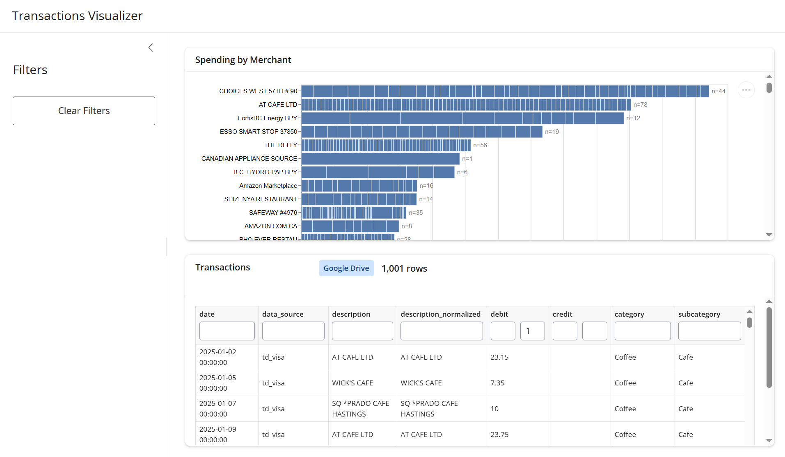

# Changelog

## [Unreleased] - 2026-03-09

### Added

- Date range filter in sidebar with "Pre-MDS" (2025-01-01 – 2025-08-25) and "MDS" (2025-08-26 – 2025-12-31) radio button presets; radio auto-switches to "Custom" when dates are edited manually
- "Clear Filters" now also resets the date range and preset radio back to defaults
- X-axis labels and ticks shown at both top and bottom of the spending chart

### Fixed

- `IndexError` when switching date presets: introduced `_date_filtered()` reactive calc (with reset index) as a single source of truth for date filtering, and `_safe_data_view()` guard that catches stale DataGrid row indices during the async clear round-trip

### Updated

- Switched remote data source from Google Drive (via `gdown`) to Google Sheets (direct CSV export URL)
- Replaced `GDRIVE_FILE_ID` env variable with `GSHEET_ID` and `GSHEET_GID`
- Removed `gdown` dependency from `requirements.txt` and `environment.yml`

## [0.1.0] - 2026-03-08

### Added

- Initial Shiny for Python app with sidebar layout and transactions table
- Stacked horizontal bar chart (Altair) grouped by merchant, sorted by total spend, reactive to table filters
- Google Drive fallback for data loading when running on deployment (Posit Connect)
- Environment variable support via `.env` / `python-dotenv` for secure config
- "Clear Filters" button to reset all table column filters
- `environment.yml` and `src/requirements.txt` for local and Posit deployment setup
- Deployed to Posit Connect

