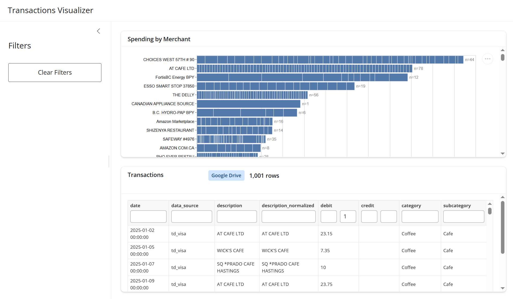

# Transactions Visualizer

[](https://github.com/stoyq/TransactionsVisualizer/actions/workflows/ci.yml)


A Shiny for Python app to explore and visualize personal transaction data.

**Live dashboard:** https://019cd142-798e-34da-392d-0d9d66b6352c.share.connect.posit.cloud



## Setup

1. Clone the repo and create the conda environment:
   ```bash
   conda env create -f environment.yml
   conda activate transactionsViz
   ```

2. Copy the example environment file:
   ```
   cp .env.example .env
   ```

   Then set `GSHEET_ID` and `GSHEET_GID` in `.env`. Both values come from
   the Google Sheets URL:

   ```text
   https://docs.google.com/spreadsheets/d/<GSHEET_ID>/edit#gid=<GSHEET_GID>
   ```

   Use only the ID values, not the full URL. The sheet must be shared as
   **Anyone with the link** so the app can download it as CSV. `GSHEET_GID`
   identifies the tab and is usually `0` for the first tab.

3. Run the app:
   ```bash
   shiny run src/app.py
   ```

## Data

Place `transactions_2025.csv` in `data/processed/` for local development. If the local file is not found, the app loads the configured Google Sheet instead (as it does on deployment).

## Deployment

For multiple datasets in one spreadsheet, set `GSHEET_ID` together with
`GSHEET_GID_TAIWAN_2026` and `GSHEET_GID_VAN_2025` to the respective tab IDs.
When local CSVs are absent, the dropdown offers Taiwan 2026 and Vancouver 2025.
Switching tabs resets the date range and table filters while retaining the debit scale.
If neither named tab is configured, the app uses the original `GSHEET_GID` setting.
Local CSVs in `data/processed/` take priority over Google Sheets.

Deployed on [Posit Connect](https://posit.co/products/cloud/connect/). Set
`GSHEET_ID` and `GSHEET_GID` as deployment environment variables; no `.env`
file is needed on the server.
